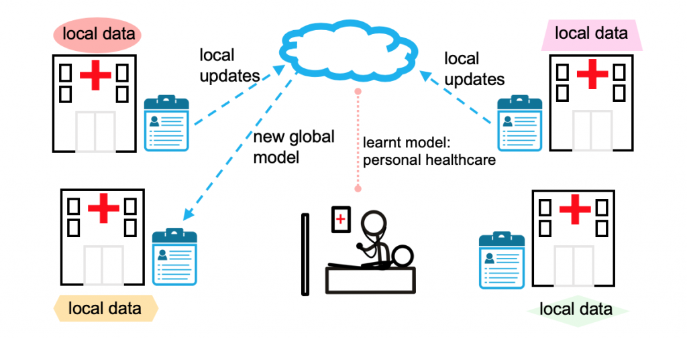

# Awesome-Federated-Learning-for-Healthcare
Federated Learning (FL) is a distributed machine learning framework, which allows multiple hospitals/institutions to collaboratively train a shared model without sharing private data, thereby reducing privacy and security risk.

## Motivation
Although there are some Awesome Federated Learning Libraries, they do not comprehensively contains papers in medical fields. 

1. <a href="https://github.com/chaoyanghe/Awesome-Federated-Learning">https://github.com/chaoyanghe/Awesome-Federated-Learning</a>

2. <a href="https://github.com/innovation-cat/Awesome-Federated-Machine-Learning">https://github.com/innovation-cat/Awesome-Federated-Machine-Learning</a>

3. <a href="https://github.com/poga/awesome-federated-learning">https://github.com/poga/awesome-federated-learning</a>

4. <a href="https://github.com/weimingwill/awesome-federated-learning">https://github.com/weimingwill/awesome-federated-learning</a>

5. <a href="https://github.com/tushar-semwal/awesome-federated-computing">https://github.com/tushar-semwal/awesome-federated-computing</a>

6. <a href="https://github.com/ChanChiChoi/awesome-Federated-Learning">https://github.com/ChanChiChoi/awesome-Federated-Learning</a>

## Papers
### Survey
<table border=0 cellpadding=0 cellspacing=0 >
  <col width="5%" style='mso-width-source:userset;mso-width-alt:6848'>
	<col width="65%" style='mso-width-source:userset;mso-width-alt:26080'>
	<col width="25%" style='mso-width-source:userset;mso-width-alt:4032'>
	<col width="5%" style='mso-width-source:userset;mso-width-alt:4032'>
	<tr height=19 style='height:14.25pt'>
		<td height=19 class=xl6519452 width="5%" align="center">ID</td>
		<td class=xl6519452 width="65%" align="center">Title</td>
		<td class=xl6519452 width="25%" align="center">Publication</td>
		<td class=xl6519452 width="5%" align="center">Materials</td>
	</tr>
	<tr height=19 style='height:14.15pt'>
        <td class=xl6519452 align="center">1</td>
        <td class=xl6519452 align="center"><a href="https://ieeexplore.ieee.org/abstract/document/9794622">Federated Learning for Privacy Preservation in Smart Healthcare Systems: A Comprehensive Survey</a></td>
        <td class=xl6519452 align="center">JBHI</td>
	<td class=xl6519452 align="center"></td>
	</tr>
</table>

### 2023
<table border=0 cellpadding=0 cellspacing=0 >
  <col width="5%" style='mso-width-source:userset;mso-width-alt:6848'>
	<col width="65%" style='mso-width-source:userset;mso-width-alt:26080'>
	<col width="25%" style='mso-width-source:userset;mso-width-alt:4032'>
	<col width="5%" style='mso-width-source:userset;mso-width-alt:4032'>
	<tr height=19 style='height:14.25pt'>
		<td height=19 class=xl6519452 width="5%" align="center">ID</td>
		<td class=xl6519452 width="65%" align="center">Title</td>
		<td class=xl6519452 width="25%" align="center">Publication</td>
		<td class=xl6519452 width="5%" align="center">Materials</td>
	</tr>
	<tr height=19 style='height:14.15pt'>
        <td class=xl6519452 align="center">1</td>
        <td class=xl6519452 align="center"><a href="https://arxiv.org/abs/2304.05635">Unifying and Personalizing Weakly-supervised Federated Medical Image Segmentation via Adaptive 	Representation and Aggregation</a></td>
        <td class=xl6519452 align="center"></td>
	<td class=xl6519452 align="center"><a href="https://github.com/llmir/FedICRA">code</a></td>
	</tr>
	<tr height=19 style='height:14.15pt'>
        <td class=xl6519452 align="center">2</td>
        <td class=xl6519452 align="center"><a href="https://ieeexplore.ieee.org/abstract/document/10013742">FedDM: Federated Weakly Supervised Segmentation via Annotation Calibration and Gradient De-conflicting</a></td>
        <td class=xl6519452 align="center">TMI</td>
	<td class=xl6519452 align="center"><a href="https://github.com/CityU-AIM-Group/FedDM">code</a></td>
	</tr>
	<tr height=19 style='height:14.15pt'>
        <td class=xl6519452 align="center">3</td>
        <td class=xl6519452 align="center"><a href="https://arxiv.org/pdf/2304.06931.pdf">Scale Federated Learning for Label Set Mismatch in Medical Image Classification</a></td>
        <td class=xl6519452 align="center"></td>
	<td class=xl6519452 align="center"></td>
	</tr>
	<tr height=19 style='height:14.15pt'>
        <td class=xl6519452 align="center">4</td>
        <td class=xl6519452 align="center"><a href="https://arxiv.org/pdf/2304.09327.pdf">Federated Alternate Training (FAT): Leveraging Unannotated Data Silos in Federated Segmentation for Medical Imaging</a></td>
        <td class=xl6519452 align="center">ISBI</td>
	<td class=xl6519452 align="center"></td>
	</tr>
	<tr height=19 style='height:14.15pt'>
        <td class=xl6519452 align="center">5</td>
        <td class=xl6519452 align="center"><a href="https://arxiv.org/pdf/2303.16181.pdf">Learning Federated Visual Prompt in Null Space for MRI Reconstruction</a></td>
        <td class=xl6519452 align="center">CVPR</td>
	<td class=xl6519452 align="center"><a href="https://github.com/chunmeifeng/FedPR">Code</a></td>
	</tr>
	<tr height=19 style='height:14.15pt'>
        <td class=xl6519452 align="center">6</td>
        <td class=xl6519452 align="center"><a href="https://arxiv.org/pdf/2303.12317.pdf">Re-thinking Federated Active Learning based on Inter-class Diversity</a></td>
        <td class=xl6519452 align="center">CVPR</td>
	<td class=xl6519452 align="center"><a href="https://github.com/raymin0223/LoGo">Code</a></td>
	</tr>
	<tr height=19 style='height:14.15pt'>
        <td class=xl6519452 align="center">7</td>
        <td class=xl6519452 align="center"><a href="https://ieeexplore.ieee.org/abstract/document/10004993">Label-Efficient Self-Supervised Federated Learning for Tackling Data Heterogeneity in Medical Imaging</a></td>
        <td class=xl6519452 align="center">TMI</td>
	<td class=xl6519452 align="center"><a href="https://github.com/rui-yan/SSL-FL">Code</a></td>
	</tr>
	<tr height=19 style='height:14.15pt'>
        <td class=xl6519452 align="center">8</td>
        <td class=xl6519452 align="center"><a href="https://arxiv.org/pdf/2304.14976.pdf">Quality-Adaptive Split-Federated Learning for Segmenting Medical Images with Inaccurate Annotations</a></td>
        <td class=xl6519452 align="center">ISBI</td>
	<td class=xl6519452 align="center"></td>
	</tr>
	<tr height=19 style='height:14.15pt'>
        <td class=xl6519452 align="center">9</td>
        <td class=xl6519452 align="center"><a href="https://arxiv.org/pdf/2303.16520.pdf">Fair Federated Medical Image Segmentation via Client Contribution Estimation
</a></td>
        <td class=xl6519452 align="center">CVPR</td>
	<td class=xl6519452 align="center"><a href="https://github.com/NVIDIA/NVFlare/tree/dev/research/fed-ce">Code</a></td>
	</tr>
	<tr height=19 style='height:14.15pt'>
        <td class=xl6519452 align="center">10</td>
        <td class=xl6519452 align="center"><a href="https://ieeexplore.ieee.org/document/10107904">Federated Multi-organ Segmentation with Inconsistent Labels
</a></td>
        <td class=xl6519452 align="center">TMI</td>
	<td class=xl6519452 align="center"><a href="https://github.com/DIAL-RPI/Fed-MENU">Code</a></td>
	</tr>	
	<tr height=19 style='height:14.15pt'>
        <td class=xl6519452 align="center">11</td>
        <td class=xl6519452 align="center"><a href="https://arxiv.org/pdf/2301.12798.pdf">TrFedDis: Trusted Federated Disentangling Network for Non-IID Domain Feature
</a></td>
        <td class=xl6519452 align="center"></td>
	<td class=xl6519452 align="center"></td>
	</tr>	
</table>

### 2022
<table border=0 cellpadding=0 cellspacing=0 >
  <col width="5%" style='mso-width-source:userset;mso-width-alt:6848'>
	<col width="65%" style='mso-width-source:userset;mso-width-alt:26080'>
	<col width="25%" style='mso-width-source:userset;mso-width-alt:4032'>
	<col width="5%" style='mso-width-source:userset;mso-width-alt:4032'>
	<tr height=19 style='height:14.25pt'>
		<td height=19 class=xl6519452 width="5%" align="center">ID</td>
		<td class=xl6519452 width="65%" align="center">Title</td>
		<td class=xl6519452 width="25%" align="center">Publication</td>
		<td class=xl6519452 width="5%" align="center">Materials</td>
	</tr>
	<tr height=19 style='height:14.15pt'>
        <td class=xl6519452 align="center">1</td>
        <td class=xl6519452 align="center"><a href="https://ieeexplore.ieee.org/abstract/document/9832948">Personalized Retrogress-Resilient Federated Learning Towards Imbalanced Medical Data</a></td>
        <td class=xl6519452 align="center">TMI</td>
	<td class=xl6519452 align="center"><a href="https://github.com/CityU-AIM-Group/PRR-Imbalance">code</a></td>
	</tr>
	<tr height=19 style='height:14.15pt'>
        <td class=xl6519452 align="center">2</td>
        <td class=xl6519452 align="center"><a href="https://arxiv.org/pdf/2203.10144.pdf">Closing the Generalization Gap of Cross-silo Federated Medical Image Segmentation</a></td>
        <td class=xl6519452 align="center">CVPR</td>
	<td class=xl6519452 align="center"><a href="https://github.com/NVIDIA/NVFlare/tree/dev/research/fed-sm">code</a></td>
	</tr>
	<tr height=19 style='height:14.15pt'>
        <td class=xl6519452 align="center">3</td>
        <td class=xl6519452 align="center"><a href="https://arxiv.org/pdf/2203.06338.pdf">Auto-FedRL: Federated Hyperparameter Optimization for Multi-institutional Medical Image Segmentation</a></td>
        <td class=xl6519452 align="center">ECCV</td>
	<td class=xl6519452 align="center"><a href="https://github.com/guopengf/Auto-FedRL">code</a></td>
	</tr>	
	<tr height=19 style='height:14.15pt'>
        <td class=xl6519452 align="center">4</td>
        <td class=xl6519452 align="center"><a href="https://arxiv.org/pdf/2207.04655.pdf">Personalizing Federated Medical Image Segmentation via Local Calibration</a></td>
        <td class=xl6519452 align="center">ECCV</td>
	<td class=xl6519452 align="center"><a href="https://github.com/jcwang123/FedLC">code</a></td>
	</tr>
	<tr height=19 style='height:14.15pt'>
        <td class=xl6519452 align="center">5</td>
        <td class=xl6519452 align="center"><a href="https://arxiv.org/pdf/2112.10775.pdf">HarmoFL: Harmonizing Local and Global Drifts in Federated Learning on Heterogeneous Medical Images</a></td>
        <td class=xl6519452 align="center">AAAI</td>
	<td class=xl6519452 align="center"><a href="https://github.com/med-air/HarmoFL">code</a></td>
	</tr>
	<tr height=19 style='height:14.15pt'>
        <td class=xl6519452 align="center">6</td>
        <td class=xl6519452 align="center"><a href="https://arxiv.org/pdf/2210.04620.pdf">FLamby: Datasets and Benchmarks for Cross-Silo Federated Learning in Realistic Healthcare Settings</a></td>
        <td class=xl6519452 align="center">NeurIPS</td>
	<td class=xl6519452 align="center"><a href="https://github.com/owkin/flamby">code</a></td>
	</tr>
	<tr height=19 style='height:14.15pt'>
        <td class=xl6519452 align="center">7</td>
        <td class=xl6519452 align="center"><a href="https://ieeexplore.ieee.org/abstract/document/9767711">Federated Learning for Privacy Preservation of Healthcare Data From Smartphone-Based Side-Channel Attacks</a></td>
        <td class=xl6519452 align="center">JBHI</td>
	<td class=xl6519452 align="center"></td>
	</tr>
	<tr height=19 style='height:14.15pt'>
        <td class=xl6519452 align="center">8</td>
        <td class=xl6519452 align="center"><a href="https://ieeexplore.ieee.org/document/9994748">Federated partially supervised learning with limited decentralized medical images</a></td>
        <td class=xl6519452 align="center">TMI</td>
	<td class=xl6519452 align="center"></td>
	</tr>
	<tr height=19 style='height:14.15pt'>
        <td class=xl6519452 align="center">9</td>
        <td class=xl6519452 align="center"><a href="https://arxiv.org/pdf/2206.13079.pdf">Dynamic bank learning for semi-supervised federated image diagnosis with class imbalance</a></td>
        <td class=xl6519452 align="center">MICCAI</td>
	<td class=xl6519452 align="center"><a href="https://github.com/med-air/imFedSemi">Code</a></td>
	</tr>
	<tr height=19 style='height:14.15pt'>
        <td class=xl6519452 align="center">10</td>
        <td class=xl6519452 align="center"><a href="https://link.springer.com/chapter/10.1007/978-3-031-16437-8_70">Federated Medical Image Analysis with Virtual Sample Synthesis</a></td>
        <td class=xl6519452 align="center">MICCAI</td>
	<td class=xl6519452 align="center"></td>
	</tr>
	<tr height=19 style='height:14.15pt'>
        <td class=xl6519452 align="center">11</td>
        <td class=xl6519452 align="center"><a href="https://www.sciencedirect.com/science/article/pii/S1361841521003431">Federated learning for computational pathology on gigapixel whole slide images</a></td>
        <td class=xl6519452 align="center">MIA</td>
	<td class=xl6519452 align="center"><a href="https://github.com/mahmoodlab/HistoFL">Code</a></td>
	</tr>
	<tr height=19 style='height:14.15pt'>
        <td class=xl6519452 align="center">12</td>
        <td class=xl6519452 align="center"><a href="https://ieeexplore.ieee.org/abstract/document/9855868">Customized Federated Learning for Multi-Source Decentralized Medical Image Classification</a></td>
        <td class=xl6519452 align="center">JBHI</td>
	<td class=xl6519452 align="center"></td>
	</tr>
	<tr height=19 style='height:14.15pt'>
        <td class=xl6519452 align="center">13</td>
        <td class=xl6519452 align="center"><a href="https://ieeexplore.ieee.org/abstract/document/9780172">Personalized federated learning with adaptive batchnorm for health</a></td>
        <td class=xl6519452 align="center">TBD</td>
	<td class=xl6519452 align="center"><a href="https://github.com/microsoft/PersonalizedFL">Code</a></td>
	</tr>
	<tr height=19 style='height:14.15pt'>
        <td class=xl6519452 align="center">14</td>
        <td class=xl6519452 align="center"><a href="https://arxiv.org/pdf/2203.13993.pdf">RSCFed: Random Sampling Consensus Federated Semi-supervised Learning</a></td>
        <td class=xl6519452 align="center">CVPR</td>
	<td class=xl6519452 align="center"><a href="https://github.com/xmed-lab/RSCFed">Code</a></td>
	</tr>
	<tr height=19 style='height:14.15pt'>
        <td class=xl6519452 align="center">15</td>
        <td class=xl6519452 align="center"><a href="https://ieeexplore.ieee.org/abstract/document/9950359">Federated Cycling (FedCy): Semi-supervised Federated Learning of Surgical Phases</a></td>
        <td class=xl6519452 align="center">TMI</td>
	<td class=xl6519452 align="center"></td>
	</tr>	
	<tr height=19 style='height:14.15pt'>
        <td class=xl6519452 align="center">16</td>
        <td class=xl6519452 align="center"><a href="https://ieeexplore.ieee.org/abstract/document/9868072">Specificity-Preserving Federated Learning for MR Image Reconstruction</a></td>
        <td class=xl6519452 align="center">TMI</td>
	<td class=xl6519452 align="center"><a href="https://github.com/chunmeifeng/FedMRI">Code</a></td>
	</tr>
	<tr height=19 style='height:14.15pt'>
        <td class=xl6519452 align="center">17</td>
        <td class=xl6519452 align="center"><a href="https://ieeexplore.ieee.org/abstract/document/9774951">FedMix: Mixed Supervised Federated Learning for Medical Image Segmentation</a></td>
        <td class=xl6519452 align="center">TMI</td>
	<td class=xl6519452 align="center"><a href="https://github.com/Jwicaksana/FedMix">Code</a></td>
	</tr>
	<tr height=19 style='height:14.15pt'>
        <td class=xl6519452 align="center">18</td>
        <td class=xl6519452 align="center"><a href="https://ieeexplore.ieee.org/abstract/document/9943293">Federated Learning of Generative Image Priors for MRI Reconstruction</a></td>
        <td class=xl6519452 align="center">TMI</td>
	<td class=xl6519452 align="center"><a href="https://github.com/icon-lab/fedgimp">Code</a></td>
	</tr>
	<tr height=19 style='height:14.15pt'>
        <td class=xl6519452 align="center">19</td>
        <td class=xl6519452 align="center"><a href="https://ojs.aaai.org/index.php/AAAI/article/view/21446">Preserving Privacy in Federated Learning with Ensemble Cross-Domain Knowledge Distillation</a></td>
        <td class=xl6519452 align="center">AAAI</td>
	<td class=xl6519452 align="center"></td>
	</tr>
	<tr height=19 style='height:14.15pt'>
        <td class=xl6519452 align="center">20</td>
        <td class=xl6519452 align="center"><a href="https://ieeexplore.ieee.org/abstract/document/9761404">Fedsld: Federated Learning with Shared Label Distribution for Medical Image Classification</a></td>
        <td class=xl6519452 align="center">ISBI</td>
	<td class=xl6519452 align="center"></td>
	</tr>
	<tr height=19 style='height:14.15pt'>
        <td class=xl6519452 align="center">21</td>
        <td class=xl6519452 align="center"><a href="https://ieeexplore.ieee.org/abstract/document/9806163">SplitAVG: A Heterogeneity-Aware Federated Deep Learning Method for Medical Imaging</a></td>
        <td class=xl6519452 align="center">JBHI</td>
	<td class=xl6519452 align="center"><a href="https://github.com/zm17943/SplitAVG">Code</a></td>
	</tr>
	<tr height=19 style='height:14.15pt'>
        <td class=xl6519452 align="center">22</td>
        <td class=xl6519452 align="center"><a href="https://ieeexplore.ieee.org/abstract/document/9806163">Robust Split Federated Learning for U-shaped Medical Image Networks</a></td>
        <td class=xl6519452 align="center"></td>
	<td class=xl6519452 align="center"><a href="https://github.com/Zi-YuanYang/RoS-FL">Code</a></td>
	</tr>
	<tr height=19 style='height:14.15pt'>
        <td class=xl6519452 align="center">23</td>
        <td class=xl6519452 align="center"><a href="https://arxiv.org/pdf/2206.13803.pdf">Federated Learning with Imbalanced and Agglomerated Data Distribution for Medical Image Classification</a></td>
        <td class=xl6519452 align="center"></td>
	<td class=xl6519452 align="center"></td>
	</tr>
	<tr height=19 style='height:14.15pt'>
        <td class=xl6519452 align="center">24</td>
        <td class=xl6519452 align="center"><a href="https://arxiv.org/pdf/2110.08394.pdf">Adapt to Adaptation: Learning Personalization for Cross-Silo Federated Learning</a></td>
        <td class=xl6519452 align="center">IJCAI</td>
	<td class=xl6519452 align="center"><a href="https://github.com/ljaiverson/pFL-APPLE">Code</a></td>
	</tr>
</table>

### 2021
<table border=0 cellpadding=0 cellspacing=0 >
  <col width="5%" style='mso-width-source:userset;mso-width-alt:6848'>
	<col width="65%" style='mso-width-source:userset;mso-width-alt:26080'>
	<col width="25%" style='mso-width-source:userset;mso-width-alt:4032'>
	<col width="5%" style='mso-width-source:userset;mso-width-alt:4032'>
	<tr height=19 style='height:14.25pt'>
		<td height=19 class=xl6519452 width="5%" align="center">ID</td>
		<td class=xl6519452 width="65%" align="center">Title</td>
		<td class=xl6519452 width="25%" align="center">Publication</td>
		<td class=xl6519452 width="5%" align="center">Materials</td>
	</tr>
	<tr height=19 style='height:14.15pt'>
        <td class=xl6519452 align="center">1</td>
        <td class=xl6519452 align="center"><a href="https://link.springer.com/chapter/10.1007/978-3-030-87199-4_33">Personalized Retrogress-Resilient Framework for Real-World Medical Federated Learning</a></td>
        <td class=xl6519452 align="center">MICCAI</td>
	<td class=xl6519452 align="center"><a href="https://github.com/CityU-AIM-Group/PRR-FL">code</a></td>
	</tr>
	<tr height=19 style='height:14.15pt'>
        <td class=xl6519452 align="center">2</td>
        <td class=xl6519452 align="center"><a href="https://arxiv.org/pdf/2103.06030.pdf">FedDG: Federated Domain Generalization on Medical Image Segmentation via Episodic Learning in Continuous Frequency Space</a></td>
        <td class=xl6519452 align="center">CVPR</td>
	<td class=xl6519452 align="center"><a href="https://github.com/liuquande/FedDG-ELCFS">code</a></td>
	</tr>	
	<tr height=19 style='height:14.15pt'>
        <td class=xl6519452 align="center">3</td>
        <td class=xl6519452 align="center"><a href="https://arxiv.org/pdf/2102.05218.pdf">FLOP: Federated Learning on Medical Datasets using Partial Networks</a></td>
        <td class=xl6519452 align="center">KDD</td>
	<td class=xl6519452 align="center"><a href="https://github.com/jianyizhang123/FLOP">code</a></td>
	</tr>		
	<tr height=19 style='height:14.15pt'>
        <td class=xl6519452 align="center">4</td>
        <td class=xl6519452 align="center"><a href="https://openreview.net/pdf?id=6YEQUn0QICG">FedBN: Federated Learning on Non-IID Features via Local Batch Normalization</a></td>
        <td class=xl6519452 align="center">ICLR</td>
	<td class=xl6519452 align="center"><a href="https://github.com/med-air/FedBN">code</a></td>
	</tr>		
	<tr height=19 style='height:14.15pt'>
        <td class=xl6519452 align="center">5</td>
        <td class=xl6519452 align="center"><a href="https://www.sciencedirect.com/science/article/pii/S1361841521000384">Federated semi-supervised learning for COVID region segmentation in chest CT using multi-national data from China, Italy, Japan</a></td>
        <td class=xl6519452 align="center">MIA</td>
	<td class=xl6519452 align="center"></td>
	</tr>		
	<tr height=19 style='height:14.15pt'>
        <td class=xl6519452 align="center">6</td>
        <td class=xl6519452 align="center"><a href="https://arxiv.org/pdf/2103.03703.pdf">Fedperl: semi-supervised peer learning for skin lesion classification</a></td>
        <td class=xl6519452 align="center">MICCAI</td>
	<td class=xl6519452 align="center"><a href="https://www.melba-journal.org/papers/2022:011.html">Project</a></td>
	</tr>		
	<tr height=19 style='height:14.15pt'>
        <td class=xl6519452 align="center">7</td>
        <td class=xl6519452 align="center"><a href="https://arxiv.org/pdf/2204.07352v2.pdf">A Differentially Private Probabilistic Framework for Modeling the Variability Across Federated Datasets of Heterogeneous Multi-View Observations
</a></td>
        <td class=xl6519452 align="center">IPMI</td>
	<td class=xl6519452 align="center"><a href="https://www.melba-journal.org/papers/2022:012.html">Project</a>   <a href="https://gitlab.inria.fr/epione/federated-multi-views-ppca">Code</a></td>
	</tr>	
	<tr height=19 style='height:14.15pt'>
        <td class=xl6519452 align="center">8</td>
        <td class=xl6519452 align="center"><a href="https://link.springer.com/chapter/10.1007/978-3-030-87199-4_31">Federated semi-supervised medical image classification via inter-client relation matching</a></td>
        <td class=xl6519452 align="center">MICCAI</td>
	<td class=xl6519452 align="center"><a href="https://github.com/liuquande/FedIRM">Code</a></td>
	</tr>
	<tr height=19 style='height:14.15pt'>
        <td class=xl6519452 align="center">9</td>
        <td class=xl6519452 align="center"><a href="https://arxiv.org/pdf/2204.10983.pdf">Federated Contrastive Learning for Volumetric Medical Image Segmentation</a></td>
        <td class=xl6519452 align="center">MICCAI</td>
	<td class=xl6519452 align="center"></td>
	</tr>
	<tr height=19 style='height:14.15pt'>
        <td class=xl6519452 align="center">10</td>
        <td class=xl6519452 align="center"><a href="https://arxiv.org/pdf/2107.08111.pdf">Federated Whole Prostate Segmentation in MRI with Personalized Neural Architectures</a></td>
        <td class=xl6519452 align="center">MICCAI</td>
	<td class=xl6519452 align="center"></td>
	</tr>	
	<tr height=19 style='height:14.15pt'>
        <td class=xl6519452 align="center">11</td>
        <td class=xl6519452 align="center"><a href="https://openaccess.thecvf.com/content/ICCV2021/papers/Gong_Ensemble_Attention_Distillation_for_Privacy-Preserving_Federated_Learning_ICCV_2021_paper.pdf">Ensemble Attention Distillation for Privacy-Preserving Federated Learning</a></td>
        <td class=xl6519452 align="center">ICCV</td>
	<td class=xl6519452 align="center"></td>
	</tr>	
	<tr height=19 style='height:14.15pt'>
        <td class=xl6519452 align="center">12</td>
        <td class=xl6519452 align="center"><a href="https://arxiv.org/pdf/2109.07504.pdf">Federated Contrastive Learning for Decentralized Unlabeled Medical Images</a></td>
        <td class=xl6519452 align="center">MICCAI</td>
	<td class=xl6519452 align="center"></td>
	</tr>
	<tr height=19 style='height:14.15pt'>
        <td class=xl6519452 align="center">13</td>
        <td class=xl6519452 align="center"><a href="https://ieeexplore.ieee.org/abstract/document/9347454">Dynamic-Fusion-Based Federated Learning for COVID-19 Detection</a></td>
        <td class=xl6519452 align="center">IoT</td>
	<td class=xl6519452 align="center"></td>
	</tr>
	<tr height=19 style='height:14.15pt'>
        <td class=xl6519452 align="center">14</td>
        <td class=xl6519452 align="center"><a href="https://www.nature.com/articles/s41591-021-01506-3">Federated learning for predicting clinical outcomes in patients with COVID-19</a></td>
        <td class=xl6519452 align="center">Nature Medicine</td>
	<td class=xl6519452 align="center"></td>
	</tr>
</table>

### 2020
<table border=0 cellpadding=0 cellspacing=0 >
  <col width="5%" style='mso-width-source:userset;mso-width-alt:6848'>
	<col width="65%" style='mso-width-source:userset;mso-width-alt:26080'>
	<col width="25%" style='mso-width-source:userset;mso-width-alt:4032'>
	<col width="5%" style='mso-width-source:userset;mso-width-alt:4032'>
	<tr height=19 style='height:14.25pt'>
		<td height=19 class=xl6519452 width="5%" align="center">ID</td>
		<td class=xl6519452 width="65%" align="center">Title</td>
		<td class=xl6519452 width="25%" align="center">Publication</td>
		<td class=xl6519452 width="5%" align="center">Materials</td>
	</tr>
	<tr height=19 style='height:14.15pt'>
        <td class=xl6519452 align="center">1</td>
        <td class=xl6519452 align="center"><a href="https://link.springer.com/chapter/10.1007/978-3-030-60548-3_15">Inverse distance aggregation for federated learning with non-iid data</a></td>
        <td class=xl6519452 align="center">MICCAI-W</td>
	<td class=xl6519452 align="center"><a href="https://ida-fl.github.io/">Project</a></td>
	</tr>
	<tr height=19 style='height:14.15pt'>
        <td class=xl6519452 align="center">2</td>
        <td class=xl6519452 align="center"><a href="https://ieeexplore.ieee.org/abstract/document/9268161">Variation-Aware Federated Learning With Multi-Source Decentralized Medical Image Data</a></td>
        <td class=xl6519452 align="center">JBHI</td>
	<td class=xl6519452 align="center"></td>
	</tr>
	<tr height=19 style='height:14.15pt'>
        <td class=xl6519452 align="center">3</td>
        <td class=xl6519452 align="center"><a href="https://ieeexplore.ieee.org/abstract/document/9268161">Fed-Sim: Federated Simulation for Medical Imaging</a></td>
        <td class=xl6519452 align="center">MICCAI</td>
	<td class=xl6519452 align="center"><a href="https://nv-tlabs.github.io/fed-sim/">Project</a></td>
	</tr>
	<tr height=19 style='height:14.15pt'>
        <td class=xl6519452 align="center">4</td>
        <td class=xl6519452 align="center"><a href="https://openaccess.thecvf.com/content_CVPR_2020/html/Chang_Synthetic_Learning_Learn_From_Distributed_Asynchronized_Discriminator_GAN_Without_Sharing_CVPR_2020_paper.html">Synthetic learning: Learn from distributed asynchronized discriminator gan without sharing medical image data</a></td>
        <td class=xl6519452 align="center">CVPR</td>
	<td class=xl6519452 align="center"><a href="https://github.com/tommy-qichang/AsynDGAN">Code</a></td>
	</tr>
	<tr height=19 style='height:14.15pt'>
        <td class=xl6519452 align="center">5</td>
        <td class=xl6519452 align="center"><a href="https://www.sciencedirect.com/science/article/pii/S1361841520301298">Multi-site fMRI analysis using privacy-preserving federated learning and domain adaptation: ABIDE results</a></td>
        <td class=xl6519452 align="center">MIA</td>
	<td class=xl6519452 align="center"><a href="https://github.com/xxlya/Fed_ABIDE">Code</a></td>
	</tr>
	<tr height=19 style='height:14.15pt'>
        <td class=xl6519452 align="center">6</td>
        <td class=xl6519452 align="center"><a href="https://link.springer.com/chapter/10.1007/978-3-030-60548-3_18">Federated Learning for Breast Density Classification: A Real-World Implementation</a></td>
        <td class=xl6519452 align="center">MICCAI-W</td>
	<td class=xl6519452 align="center"></td>
	</tr>
</table>

## Federated Medical Datasets
<table border=0 cellpadding=0 cellspacing=0 >
  <col width="5%" style='mso-width-source:userset;mso-width-alt:6848'>
	<col width="65%" style='mso-width-source:userset;mso-width-alt:26080'>
	<col width="25%" style='mso-width-source:userset;mso-width-alt:4032'>
	<col width="5%" style='mso-width-source:userset;mso-width-alt:4032'>
	<tr height=19 style='height:14.25pt'>
		<td height=19 class=xl6519452 width="5%" align="center">ID</td>
		<td class=xl6519452 width="25%" align="center">Name</td>
		<td class=xl6519452 width="65%" align="center">Introduction</td>
		<td class=xl6519452 width="5%" align="center">Link</td>
	</tr>
	<tr height=19 style='height:14.15pt'>
        <td class=xl6519452 align="center">1</td>
	<td class=xl6519452 align="center">Fed-Camelyon16 [FLamby]</td>
        <td class=xl6519452 align="center">Dataset size: 900 GB.   
		Client number: 2 centers - RUMC and UMCU.   
		Class number: . 
		Task: Classification.  
		Records per center: RUMC: 169 (Train) + 74 (Test), UMCU: 101 (Train) + 55 (Test).  </td>
	<td class=xl6519452 align="center"><a href="https://github.com/owkin/FLamby/blob/main/flamby/datasets/fed_camelyon16/README.md">Link</a></td>
	</tr>
</table>
